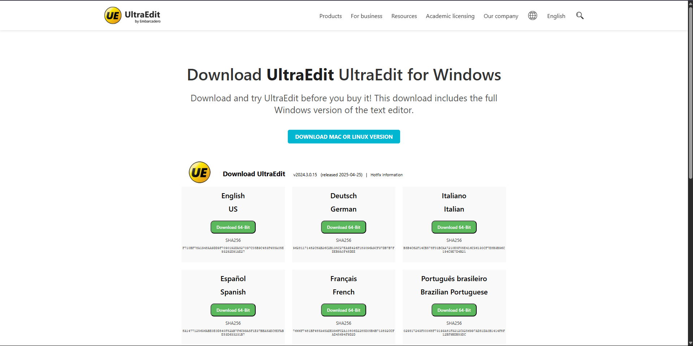

# Sigma Web Development - Exercise 7: Complete Page Layout

This repository contains my solution for Exercise 7 of the Sigma Web Development course. The project is a complete, single-page layout for a professional software download page, featuring multiple sections and modern CSS styling.

---

## 🚀 Project Features & Concepts

This project demonstrates the ability to build a full, multi-section webpage from scratch.

- **Clean & Professional UI:** A modern design with a clear visual hierarchy, inspired by real-world software websites.
- **Sticky Header:** The navigation bar remains fixed to the top for easy navigation while scrolling.
- **Responsive Grid Layout:** The language download section uses CSS Grid for a flexible layout that adapts to different screen sizes.
- **Detailed Multi-Column Footer:** A comprehensive footer with company info, quick links, and social media placeholders.
- **Hover Effects & Transitions:** Subtle animations and hover effects on buttons and links to improve user experience.
- **Organized Code:** All styles are managed in an external `style.css` file for clean and maintainable code.

## 🛠️ Tech Stack

- HTML5
- CSS3 (Flexbox, CSS Grid, Sticky Positioning)
- JavaScript (for auto-updating copyright year)

## 🙏 Acknowledgements

- This project is part of the **Sigma Web Development Course** by **CodeWithHarry**.
